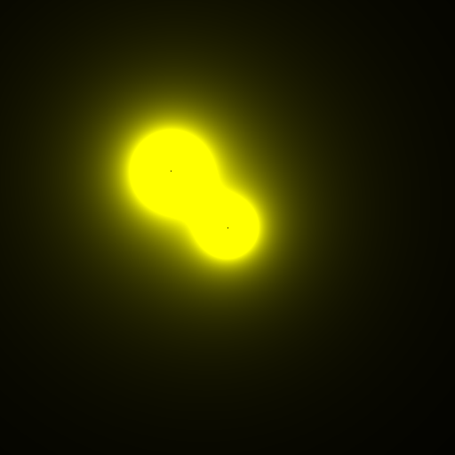

# EasyBMP

### EasyBMP is an easy to use library to generate BMP images with a simple structure to prototype any project with image generation requirement.

The API it's really simple.

The namespace it's `EasyBMP`. 
This little tutorial won't use "using namespace".

You have 2 classes (`EasyBMP::Image`, `EasyBMP::RGBColor`).

### `EasyBMP::RGBColor`
-----------------------

`EasyBMP::RGBColor` just have 2 constructors:

```cpp
EasyBMP::RGBColor(uint8_t r, uint8_t g, uint8_t b); // Just r,g,b
EasyBMP::RGBColor(); // Empty constructor, you need to assign values manually
```

This means that you have two ways to create an instance of `EasyBMP::RGBColor`:

```cpp
// Using the rgb constructor:
EasyBMP::RGBColor yellow1 = EasyBMP::RGBColor(255, 255, 0);

// Or using the void constructor and set values manually using SetColor:
EasyBMP::RGBColor yellow2;
yellow2.SetColor(255, 255, 0);
```
`EasyBMP::SetColor` is defined as:
```c++
RGBColor::SetColor(uint8_t r, uint8_t g, uint8_t b);
```
I personally recommend to use the first option because code may have some errors if you forget to set color.

You can also acces variables using `.r`, `.g` or `.b`:
```cpp
EasyBMP::RGBColor yellow1 = EasyBMP::RGBColor(255, 255, 0);
uint8_t yellow1_green = yellow1.g;
```

### `EasyBMP::Image`
--------------------

You have some constructors to create an instance of an `EasyBMP::Image`:

```cpp
EasyBMP::Image(int64_t width, int64_t height);
EasyBMP::Image(int64_t width, int64_t height, string fileName);
EasyBMP::Image(int64_t width, int64_t height, RGBColor backgroundColor);
EasyBMP::Image(int64_t width, int64_t height, string fileName, RGBColor backgroundColor);
```
For example:

```cpp
/*
This will create an image "img" with size 512x512,
on a file "sample.bmp", and the background will be yellow.
*/
EasyBMP::Image img(512, 512, "sample.bmp", EasyBMP::RGBColor(255, 255, 0));
```

To modify a single pixel, you can use `EasyBMP::Image::SetPixel`:

```cpp
img.SetPixel(x, y, EasyBMP::RGBColor(r, g, b));
```

Defined as:

```cpp
EasyBMP::Image::SetPixel(int64_t x, int64_t y, RGBColor color);
```

# Full example: A 512x512 image with two Metaballs
```cpp
#include "EasyBMP.hpp"
#include <iostream>
#include <vector>
#include <cmath>
using namespace std;

struct point
{
  double x, y;
  point(double _x, double _y) : x(_x), y(_y) { }
  double distanceTo(const point& o) {
    double dx = (x - o.x);
    double dy = (y - o.y);
    return sqrt(dx * dx + dy * dy);
  }
};

int main()
{
  vector< point > centers = {
    {256, 256},
    {192, 192}
  };
  vector< double > charges = {1024.0, 2048.0};
  // R, G, B [0, 255]
  EasyBMP::RGBColor black(0, 0, 0);  
  // sizeX, sizeY, FileName, BackgroundColor
  EasyBMP::Image img(512, 512, "sample.bmp", black);

  for (int y = 0; y < 512; ++y) {
    for (int x = 0; x < 512; ++x) {
      double intensity = 0.0;
      for (int i = 0; i < 2; ++i) {
        double dist = max(centers[i].distanceTo(point(x, y)), 1.0);
        intensity += charges[i] / (dist * dist);
      }
      int final_color = min(255, int(255. * intensity));
      // PositionX, PisitionY, Color
      img.SetPixel(x, y, EasyBMP::RGBColor(final_color, final_color, 0));
    }
  }
  img.Write();
  return 0;
}
```
### Result:


